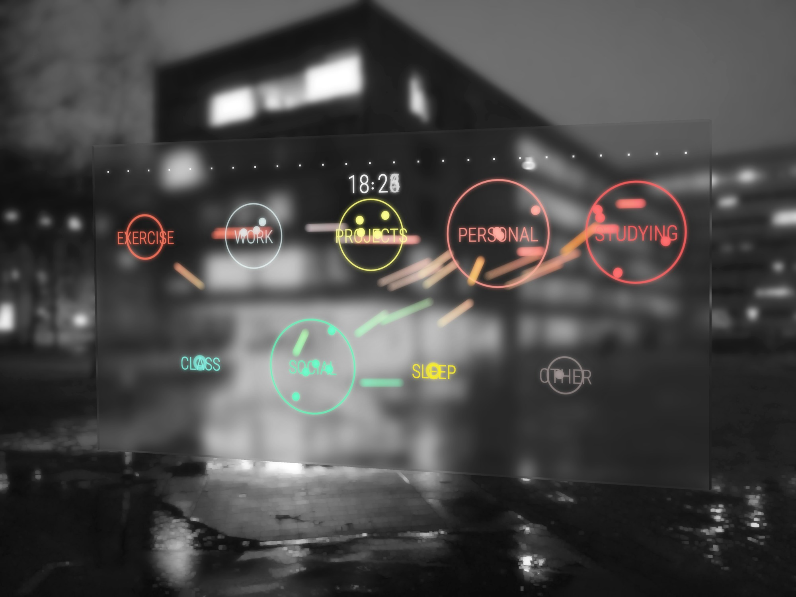
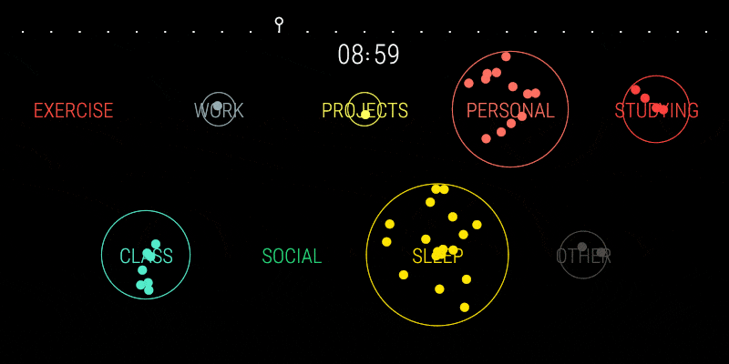
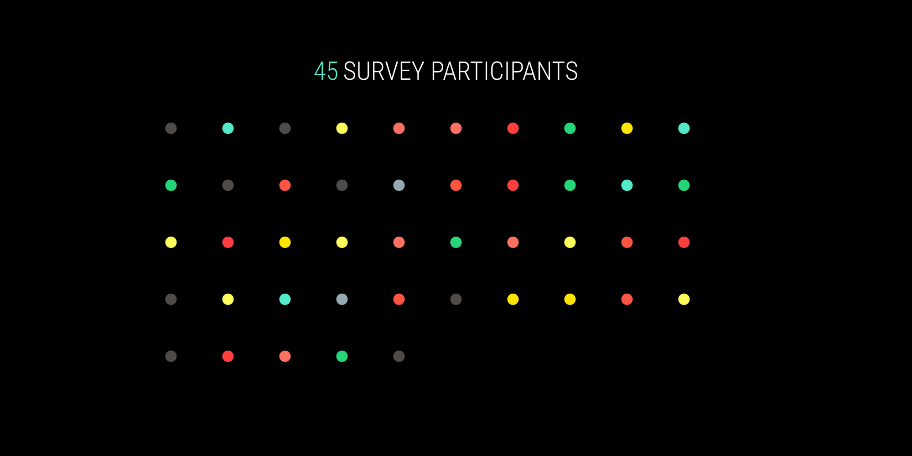
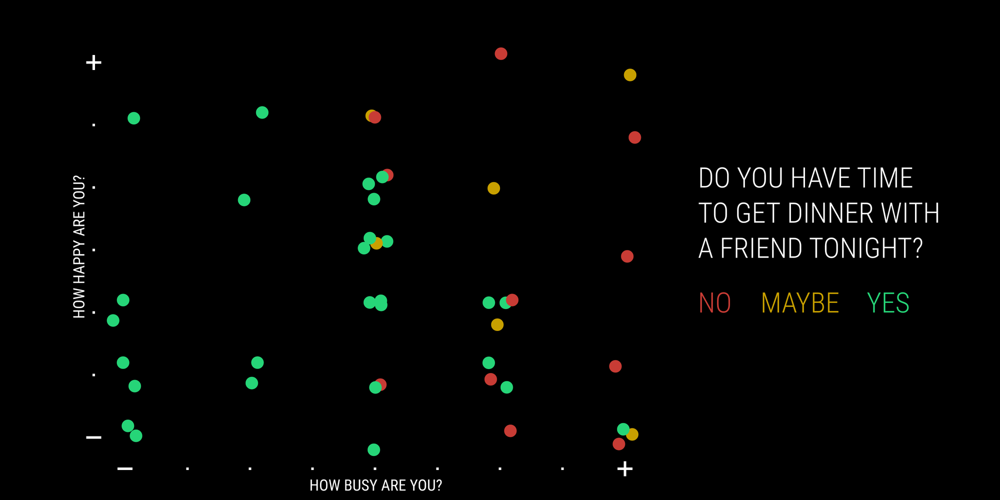
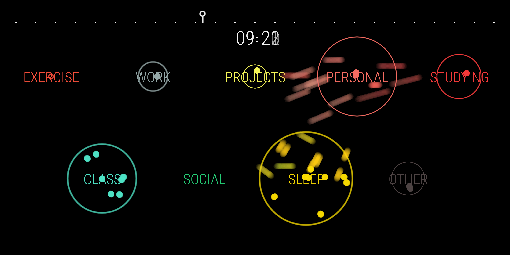
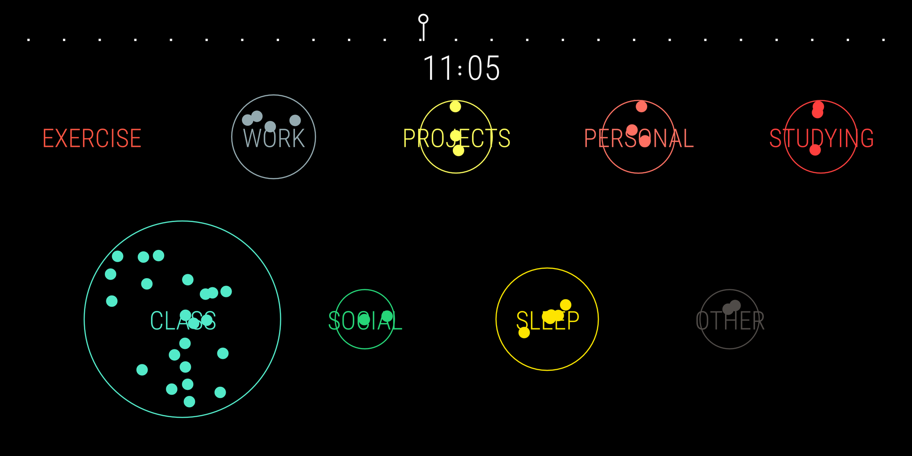
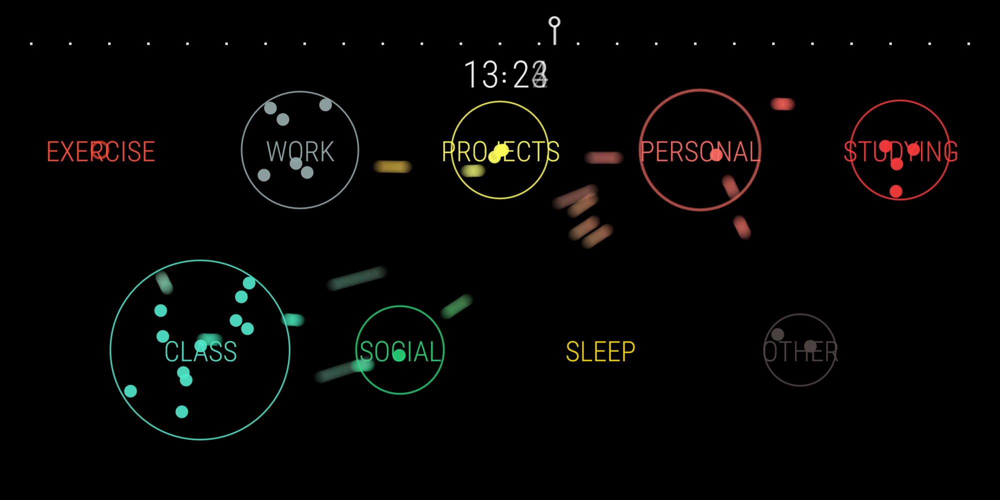
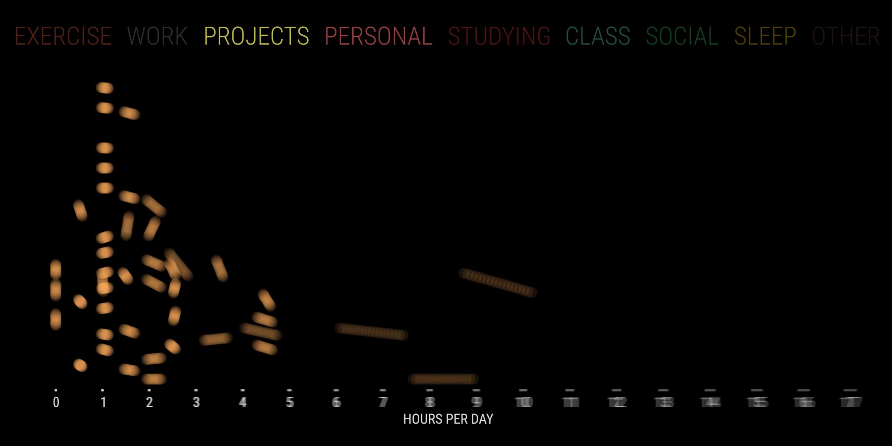
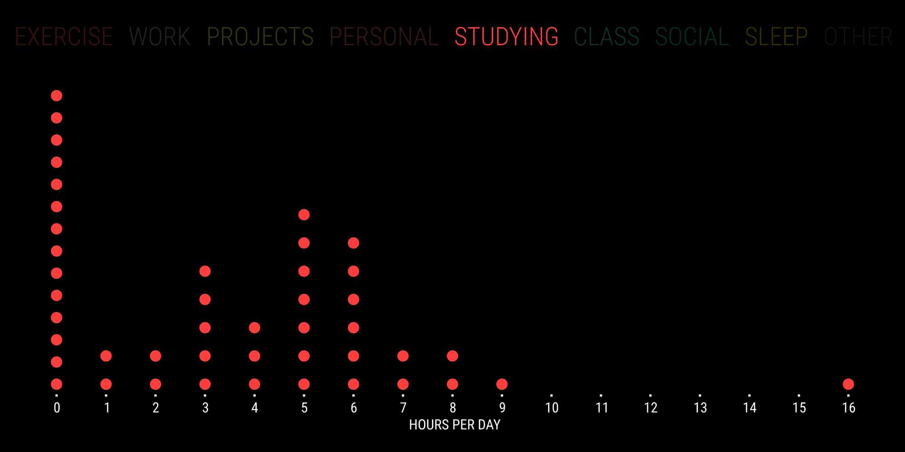
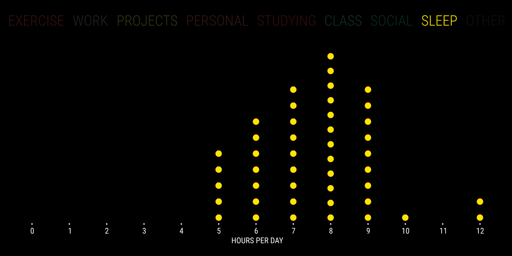

# Suspended Time

From class schedules to solar cycles, from sleep to socialization, daily rhythms form the invisible backbone of a student's day. Suspended Time seeks to shed light on student time use through data collection and visualization, as a projected art installation.

[View in Browser](https://willy-vvu.github.io/SuspendedTime)

[Watch the Video](https://www.youtube.com/watch?v=0fhPgU8s63Y)

---

In Collaboration with: Katherine Nazemi

Supported by: MIT [ProjX](https://projx.mit.edu/)

Learning Focus: Information Design, Motion Design, p5.js

Media: Data Visualization, Motion Graphic

Software: p5.js

Date: January 2017
